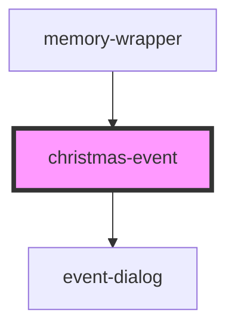

# christmas-event

<!-- Auto Generated Below -->

## Properties

| Property | Attribute | Description | Type                                                    | Default     |
| -------- | --------- | ----------- | ------------------------------------------------------- | ----------- |
| `ev`     | --        |             | `{ name: string; mainImage: string; items: Memory[]; }` | `undefined` |

## Dependencies

### Used by

 - [memory-wrapper](../memory-wrapper)

### Depends on

- [event-dialog](../event-dialog)

### Graph

----------------------------------------------

*Built with [StencilJS](https://stenciljs.com/)*
